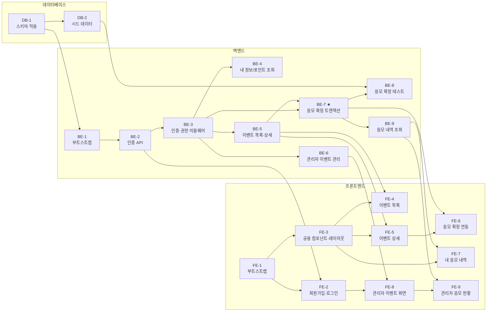

# 프레시밀 포인트 이벤트 응모(freshmeal-point-event) 개발 실행계획

버전: v1.4 (2026-08-13)

기반 문서:
- `docs/2-domain-definition.md` v1.5 (도메인 정의서)
- `docs/3-usecase.md` v1.1 (유스케이스)
- `docs/4-PRD.md` v1.4 (PRD)
- `docs/5-user-scenario.md` v1.1 (사용자 시나리오)
- `docs/6-project-principle.md` v1.2 (구조 설계 원칙)
- `docs/7-arch-diagram.md` v1.2 (아키텍처 다이어그램)
- `docs/8-wireframe.md` v1.2 (와이어프레임)
- `docs/9-erd.md` v1.1 (ERD)
- `docs/10-schema.sql` (PostgreSQL DDL)
- `docs/swagger.json` (OpenAPI 3.0.3 스펙)

## 1. 개요

3일/1인 개발(PRD 9장) 제약 아래 MVP(PRD 4~5장 Must/Should)를 구현하기 위한 작업 분해 계획이다.

- 작업 단위: **DB(데이터베이스) → BE(백엔드) → FE(프론트엔드)** 3개 그룹, Task ID로 의존성을 참조한다.
- 파일 경로는 `6-project-principle.md` 6~7장 디렉토리 구조를 그대로 따른다.
- PRD 11장 Out of Scope(알림, 배포/모니터링, 취소·환불, 포인트 충전, 추첨, a11y 등)에 대한 Task는 만들지 않는다.
- 우선순위는 PRD 5장을 따른다: UC-12만 Should, 나머지 UC는 Must. 프로젝트 부트스트랩/공통 작업은 Must로 취급한다.

## 2. Task 요약

| ID | 제목 | 우선순위 | 선행 |
|---|---|---|---|
| DB-1 | 데이터베이스 생성 및 스키마 적용 | Must | 없음 |
| DB-2 | 시드 데이터 구성 | Must | DB-1 |
| BE-1 | 백엔드 프로젝트 부트스트랩 (app/config/pool/미들웨어/도메인 상수) | Must | DB-1 |
| BE-2 | 인증 API — 회원가입/로그인/토큰 재발급/로그아웃 | Must | BE-1 |
| BE-3 | JWT 인증·관리자 권한 미들웨어 | Must | BE-2 |
| BE-4 | 내 정보/보유 포인트 조회 API | Must | BE-3 |
| BE-5 | 사용자 이벤트 목록/상세 조회 API | Must | BE-3 |
| BE-6 | 관리자 이벤트 등록/수정/상태변경 API | Must | BE-3 |
| BE-7 | **응모 확정 API (원자적 트랜잭션 + 멱등성 + 동시성)** | Must | BE-3, BE-5 |
| BE-8 | 응모 확정 서비스 자동 테스트 | Must | BE-7, DB-2 |
| BE-9 | 응모 내역 조회 API (내 내역 / 이벤트별 현황) | Must(UC-8) / Should(UC-12) | BE-7 |
| FE-1 | 프론트엔드 부트스트랩 (라우터/QueryClient/apiClient/authStore) | Must | 없음 |
| FE-2 | 회원가입·로그인 화면 및 라우트 가드 | Must | FE-1, BE-2 |
| FE-3 | 공용 컴포넌트 및 반응형 레이아웃 기반 | Must | FE-1 |
| FE-4 | 이벤트 목록 화면 | Must | FE-3, BE-5 |
| FE-5 | 이벤트 상세 화면 (상태·최대횟수·미리보기) | Must | FE-3, BE-5 |
| FE-6 | 응모 확정 기능 연동 | Must | FE-5, BE-7 |
| FE-7 | 내 응모 내역 화면 | Must | FE-3, BE-9 |
| FE-8 | 관리자 이벤트 목록/등록·수정/상태변경 화면 | Must | FE-2, BE-6 |
| FE-9 | 관리자 이벤트별 응모 현황 화면 | Should | FE-8, BE-9 |

### 2.1 Task 의존 관계

위 표의 선행 관계를 그대로 도식화한 것이다. 화살표는 `선행 Task → 후속 Task` 방향이다.

- **시작 가능 Task(선행 없음)**: DB-1, FE-1 — 이 둘은 착수 시점에 병렬로 시작할 수 있다.
- **최장 의존 사슬(8단계)**: DB-1 → BE-1 → BE-2 → BE-3 → BE-5 → BE-7 → BE-9 → FE-7/FE-9. 이 사슬 위의 Task가 지연되면 전체 일정이 밀리므로, 6장 일정 배분에서 BE-7을 Day 2로 앞당겨 배치했다.
- **FE-1, FE-3**은 백엔드에 의존하지 않으므로 백엔드 API 대기 중 선행 작업이 가능하다.

---

## 3. DB Task

### DB-1. 데이터베이스 생성 및 스키마 적용 [Must]

**수행 작업**
- PostgreSQL 17에 개발용 데이터베이스 생성.
- `docs/10-schema.sql`을 그대로 실행하여 `users`, `events`, `event_applications`, `point_transactions`, `refresh_tokens` 5개 테이블 및 제약/인덱스 생성.
- 접속 정보를 `backend/.env` / `backend/.env.example`에 정의 (`.env`는 커밋 금지).

**선행 Task**: 없음

**관련 문서/규칙**: 9-erd.md, 10-schema.sql, 도메인 3.1~3.5 / 5.2 / 5.8, 원칙 5장(환경변수)

**완료 조건**
- [x] 5개 테이블이 모두 생성되어 있다
- [x] `ck_users_point_balance_non_negative`, `ck_events_period`, `ck_events_status` 제약이 존재한다
- [x] `uq_event_applications_user_event`, `uq_point_transactions_idempotency_key` 유니크 제약이 존재한다
- [x] 제약 위반 INSERT(음수 잔액, end_at ≤ start_at, 중복 멱등키)가 각각 실패하는 것을 확인했다
- [x] `backend/.env.example`에 DB 접속 환경변수 키가 정의되어 있다

### DB-2. 시드 데이터 구성 [Must]

**수행 작업**
- `backend/seed.sql`(또는 동등한 스크립트) 작성: 관리자 계정 1개(role=admin), 사용자 계정 2~3개(role=user, `point_balance`를 각각 0 / 800 / 5,000 등으로 세팅해 포인트 부족 케이스 재현 가능하게 함).
- 비밀번호는 bcrypt 해시로 저장.
- 샘플 이벤트 3~4건(`예정`/`진행중`/`종료` 각 1건 이상) 생성.

**선행 Task**: DB-1

**관련 문서/규칙**: 도메인 3.1(pointBalance 초기값은 시딩 가정), 6장 제외 범위(포인트 충전 없음), 시나리오 3.6-2

**완료 조건**
- [x] admin 1명, user 2명 이상이 생성되어 있고 비밀번호가 해시로 저장되어 있다
- [x] 포인트 1,000 미만 사용자와 여러 회 응모 가능한 사용자가 각각 존재한다
- [x] `예정`/`진행중`/`종료` 상태 이벤트가 각각 1건 이상 존재한다
- [x] 시드 스크립트를 반복 실행해도 개발을 진행할 수 있다(초기화 후 재실행 절차가 문서/스크립트에 있다)

---

## 4. BE Task

### BE-1. 백엔드 프로젝트 부트스트랩 [Must]

**수행 작업**
- `backend/package.json`, `backend/src/index.js`(부트스트랩), `backend/src/app.js`(Express 앱/미들웨어 등록).
- `backend/src/config/config.js`: `.env` 로드 및 필수값 검증(DB 접속, JWT 시크릿 2종, PORT, CORS origin).
- `backend/src/db/pool.js`: pg Pool 단일 인스턴스.
- `backend/src/middlewares/cors.middleware.js`(허용 origin 명시, 와일드카드 금지), `error.middleware.js`(공통 에러 핸들러), 요청 1줄 로깅.
- `backend/src/domain/constants.js`: `POINTS_PER_APPLY=1000`, `EVENT_STATUS`, 상태 전이 규칙 상수.
- `backend/src/domain/errors.js`: 도메인 에러 클래스(`InsufficientPointsError`, `EventNotOngoingError`, `InvalidApplyCountError`, `InvalidStatusTransitionError` 등) — HTTP 상태코드 매핑 포함.

**선행 Task**: DB-1

**관련 문서/규칙**: 원칙 2.2/2.3/5장, PRD 7장(기술스택), 7-arch-diagram.md 1장

**완료 조건**
- [ ] `npm start`로 서버가 기동되고 헬스 확인용 요청이 200을 반환한다
- [ ] 필수 환경변수 누락 시 서버가 기동 단계에서 에러로 중단된다
- [ ] 도메인 에러를 throw하면 공통 에러 핸들러가 4xx + 메시지로, 그 외 에러는 500 + 서버 로그 스택으로 변환한다
- [ ] CORS 허용 origin이 `.env` 값으로만 지정되며 `*`를 사용하지 않는다
- [ ] `constants.js` 외 어떤 파일에도 `1000` 포인트 값이 하드코딩되어 있지 않다

### BE-2. 인증 API — 회원가입/로그인/토큰 재발급/로그아웃 [Must]

**수행 작업**
- `backend/src/auth/auth.router.js` / `auth.controller.js` / `auth.service.js` / `auth.queries.js`.
- 엔드포인트: `POST /api/auth/signup`(UC-0), `POST /api/auth/login`(UC-1), `POST /api/auth/refresh`, `POST /api/auth/logout`.
- 비밀번호 bcrypt 해시, loginId 중복 시 409 계열 오류.
- Access Token(짧은 만료) + Refresh Token(긴 만료, 서로 다른 시크릿) 발급, Refresh Token은 해시로 `refresh_tokens`에 저장하고 로그아웃 시 `revoked_at` 설정.

**선행 Task**: BE-1

**관련 문서/규칙**: UC-0, UC-1, 시나리오 3.1-1/3.1-2/3.2-1/3.2-2, PRD 7장, 원칙 5장(JWT/비밀번호)

**완료 조건**
- [ ] 회원가입 시 role=user로 계정이 생성되고 비밀번호가 평문으로 저장되지 않는다
- [ ] 중복 loginId 가입 요청이 계정 생성 없이 오류를 반환한다
- [ ] 올바른 자격증명 로그인 시 Access/Refresh Token과 role이 응답에 포함된다
- [ ] 잘못된 자격증명 로그인 시 토큰 발급 없이 401을 반환한다
- [ ] Refresh Token으로 새 Access Token을 재발급받을 수 있고, 로그아웃 후 동일 Refresh Token 재사용이 거부된다

### BE-3. JWT 인증·관리자 권한 미들웨어 [Must]

**수행 작업**
- `backend/src/middlewares/auth.middleware.js`: Access Token 검증 후 `req.user`(id, role) 주입, 실패 시 401.
- 관리자 전용 라우트용 role 체크(같은 파일 내 `requireAdmin` 함수 하나, 별도 권한 프레임워크 없음).

**선행 Task**: BE-2

**관련 문서/규칙**: 도메인 2장(모든 기능은 인증 필요), PRD 3장, 원칙 2.3, PRD 11장(권한 세분화 제외)

**완료 조건**
- [ ] 토큰 없음/만료/위조 요청이 401을 반환한다
- [ ] 유효한 토큰 요청에서 컨트롤러가 `req.user.id`, `req.user.role`을 사용할 수 있다
- [ ] role=user가 관리자 전용 엔드포인트 호출 시 403을 반환한다

### BE-4. 내 정보/보유 포인트 조회 API [Must]

**수행 작업**
- `backend/src/users/users.router.js` / `.controller.js` / `.service.js` / `.queries.js`.
- `GET /api/me`: 본인 name, role, pointBalance 반환(UC-4).

**선행 Task**: BE-3

**관련 문서/규칙**: UC-4, 시나리오 3.5-1, 원칙 6장(PointBalanceBadge가 소비)

**완료 조건**
- [ ] 로그인 사용자가 본인 pointBalance를 조회할 수 있다
- [ ] 다른 사용자의 포인트는 조회할 수 없다(항상 토큰의 userId 기준)
- [ ] 비인증 요청은 401을 반환한다

### BE-5. 사용자 이벤트 목록/상세 조회 API [Must]

**수행 작업**
- `backend/src/events/events.router.js` / `.controller.js` / `.service.js` / `.queries.js`.
- `GET /api/events`: status가 `진행중`/`예정`인 이벤트만 반환(UC-2, `종료` 제외).
- `GET /api/events/:id`: 이벤트명/이미지/기간/경품·혜택/상태 반환(UC-3).

**선행 Task**: BE-3

**관련 문서/규칙**: UC-2, UC-3, 시나리오 3.3-1/3.4-1, 도메인 3.2

**완료 조건**
- [ ] 목록 응답에 `종료` 상태 이벤트가 포함되지 않는다
- [ ] `진행중`/`예정` 이벤트는 모두 포함된다
- [ ] 상세 응답에 이벤트명/이미지/시작·종료일시/경품설명/상태가 포함되고, 이미지·경품설명은 null이어도 정상 응답한다
- [ ] 존재하지 않는 이벤트 id 요청 시 404를 반환한다

### BE-6. 관리자 이벤트 등록/수정/상태변경 API [Must]

**수행 작업**
- BE-5의 events 4파일에 관리자 기능 추가(`requireAdmin` 적용).
- `GET /api/admin/events`(전체 상태 포함 목록), `POST /api/events`(UC-9), `PUT /api/events/:id`(UC-10), `PATCH /api/events/:id/status`(UC-11).
- `events.service.js`에 유효성 규칙: 이벤트명/기간/status 필수, `end_at > start_at`, 상태 전이는 `예정→진행중→종료`만 허용(역방향·건너뛰기 거부).

**선행 Task**: BE-3

**관련 문서/규칙**: UC-9/10/11, 도메인 3.2, 시나리오 4.1-1/4.1-2/4.2-1/4.2-2/4.3-1~4.3-4

**완료 조건**
- [ ] 필수값 누락 또는 종료일시 ≤ 시작일시 요청이 400으로 거부된다
- [ ] 이미지/경품설명 없이 등록·수정이 가능하다
- [ ] `예정→진행중`, `진행중→종료` 전이가 성공한다
- [ ] `진행중→예정`, `종료→진행중` 등 역방향 전이가 거부된다
- [ ] `예정→종료` 단계 건너뛰기가 거부된다
- [ ] role=user의 등록/수정/상태변경 요청이 403으로 거부된다

### BE-7. ★ 응모 확정 API (원자적 트랜잭션 + 멱등성 + 동시성) [Must]

**이 프로젝트에서 가장 중요한 Task다. 도메인 규칙 5.1~5.9가 모두 여기에 모인다.**

**수행 작업**
- `backend/src/applications/applications.router.js` / `.controller.js` / `.service.js` / `.queries.js`.
- `POST /api/events/:id/applications` — body: `{ count, idempotencyKey }`.
- Controller: 형식 검증만(count가 존재하는 정수 형태인지, idempotencyKey 존재 여부). 비즈니스 판단 금지.
- `applications.service.js`의 단일 트랜잭션 함수:
  1. `BEGIN`
  2. 5.8 멱등성 — 동일 `idempotency_key`의 PointTransaction 존재 시 재차감 없이 기존 결과 반환
  3. 5.9 동시성 — `SELECT ... FOR UPDATE`로 대상 User row(및 필요 시 EventApplication row) 잠금
  4. 5.3 응모 횟수 유효성 — 1 이상 정수가 아니면 거부
  5. 5.1 이벤트 상태 재확인 — `진행중`이 아니면 차감 없이 거부
  6. 5.2 잔액 재확인 — `pointBalance < count × 1,000`이면 차감 없이 거부
  7. 5.7 원자 처리 — `users.point_balance` 차감 + `event_applications` UPSERT 누적(5.4, `ON CONFLICT (user_id, event_id) DO UPDATE`로 total_count/total_points_used/last_applied_at 갱신) + `point_transactions` 1건 INSERT(type=EVENT_APPLY, amount=count×1,000)
  8. `COMMIT` / 예외 시 `ROLLBACK`
- 응답: 갱신된 pointBalance, 해당 이벤트 누적 totalCount/totalPointsUsed.
- Query 레이어는 트랜잭션 경계를 모르고 Service가 넘긴 client로만 실행한다(원칙 2.2).

**선행 Task**: BE-3, BE-5

**관련 문서/규칙**: UC-7, 도메인 5.1 / 5.2 / 5.3 / 5.4 / 5.5 / 5.7 / 5.8 / 5.9, 시나리오 3.8-1~3.8-5, 원칙 2.2 / 7장(`applications.service.js`가 가장 중요한 파일)

**완료 조건**
- [ ] 정상 응모 시 pointBalance 차감·EventApplication 누적·PointTransaction 생성이 모두 반영된다 (5.7)
- [ ] 동일 User-Event 재응모 시 새 EventApplication row가 생기지 않고 기존 row가 누적된다 (5.4)
- [ ] 포인트 부족 요청이 차감 없이 거부되고 DB 상태가 변하지 않는다 (5.2)
- [ ] `예정`/`종료` 상태 이벤트 응모가 차감 없이 거부된다 (5.1)
- [ ] count가 0/음수/소수/비숫자면 400으로 거부된다 (5.3)
- [ ] 동일 idempotencyKey 재요청이 재차감 없이 이전 결과를 반환한다 (5.8)
- [ ] 트랜잭션 중간 실패 시 세 변경이 모두 롤백된다 (5.7)
- [ ] 도메인 규칙 판단 코드가 Controller/Query가 아닌 Service에만 존재하고, 각 규칙 지점에 `// 5.x` 주석이 있다

### BE-8. 응모 확정 서비스 자동 테스트 [Must]

**수행 작업**
- `backend/src/tests/applications.service.test.js` (테스트 러너는 Node 내장 `node:test` 또는 최소 설정 Jest 중 **하나만** 선택, 새 도구 추가 금지).
- 테스트 DB(또는 시드 후 정리)로 아래 시나리오 검증.

**선행 Task**: BE-7, DB-2

**관련 문서/규칙**: 원칙 4장(테스트 원칙 — 반드시 자동 테스트 대상), 도메인 5.1~5.4 / 5.8 / 5.9

**완료 조건**
- [ ] 정상 응모 + 누적 갱신 테스트 통과 (5.4)
- [ ] 포인트 부족 거부 테스트 통과, 잔액 불변 확인 (5.2)
- [ ] `진행중`이 아닌 이벤트 거부 테스트 통과 (5.1)
- [ ] 잘못된 응모 횟수(0/음수/소수) 거부 테스트 통과 (5.3)
- [ ] 동일 idempotencyKey 재요청 시 재차감 없음 테스트 통과, PointTransaction 1건만 존재 (5.8)
- [ ] 동일 User-Event 동시 요청 2건 이상 병렬 호출 시 pointBalance가 음수가 되지 않고 성공 요청들의 (횟수×1,000) 합만큼만 감소한다 (5.9)
- [ ] `npm test` 한 줄로 전체 테스트가 실행된다

### BE-9. 응모 내역 조회 API [UC-8 Must / UC-12 Should]

**수행 작업**
- `applications` 4파일에 조회 기능 추가.
- `GET /api/me/applications`(UC-8): 본인 응모 이벤트별 이벤트명/상태/totalCount/totalPointsUsed/lastAppliedAt. `종료` 이벤트도 포함.
- `GET /api/events/:id/applications`(UC-12, `requireAdmin`): `SUM(total_count)` 전체 응모 횟수, `COUNT(*)` 참여 사용자 수. 동일 경로의 `POST`(BE-7, 응모 확정)와 메서드로만 구분되며, 별도 `/summary` 하위 경로는 두지 않는다 (`docs/swagger.json`, `6-project-principle.md` 3장 API 명명 예시와 일치).

**선행 Task**: BE-7

**관련 문서/규칙**: UC-8, UC-12, 시나리오 3.9-1 / 4.4-1, PRD 2장(KPI 산식 = SUM(totalCount))

**완료 조건**
- [ ] 내 응모 내역에 `종료` 상태 이벤트도 포함되어 조회된다
- [ ] 응답에 이벤트별 totalCount/totalPointsUsed/lastAppliedAt이 포함된다
- [ ] 다른 사용자의 응모 내역이 노출되지 않는다
- [ ] 관리자 현황 API가 전체 응모 횟수(SUM)와 참여 사용자 수(row count) 2개 값을 반환한다
- [ ] role=user의 관리자 현황 API 호출이 403으로 거부된다

---

## 5. FE Task

### FE-1. 프론트엔드 부트스트랩 [Must]

**수행 작업**
- Vite + React 19 + TypeScript 프로젝트 생성(`frontend/`).
- `src/main.tsx`(QueryClientProvider), `src/App.tsx`(라우터 정의), `src/lib/queryClient.ts`, `src/lib/apiClient.ts`(baseURL, Authorization 헤더 인터셉터, 401 시 refresh 재시도 1회), `src/stores/authStore.ts`(accessToken, role — 서버 데이터 캐시 금지).
- `frontend/.env.example`에 API baseURL 키 정의.

**선행 Task**: 없음

**관련 문서/규칙**: PRD 7장, 원칙 2.1 / 6장, 7-arch-diagram.md 2~3장

**완료 조건**
- [ ] `npm run dev`로 앱이 뜨고 라우팅이 동작한다
- [ ] apiClient가 authStore의 accessToken을 자동으로 Authorization 헤더에 실어 보낸다
- [ ] 401 응답 시 refresh 재발급을 1회 시도하고 실패하면 로그인 화면으로 보낸다
- [ ] Zustand store에 서버 데이터(이벤트/포인트/응모내역)가 저장되어 있지 않다

### FE-2. 회원가입·로그인 화면 및 라우트 가드 [Must]

**수행 작업**
- `src/pages/SignupPage.tsx`(UC-0), `src/pages/LoginPage.tsx`(UC-1).
- `src/features/auth/authApi.ts`, `useSignup.ts`, `useLogin.ts`(TanStack Query mutation).
- 로그인 성공 시 토큰 저장 후 role에 따라 사용자 이벤트 목록/관리자 이벤트 목록으로 이동.
- 비로그인 접근 차단 가드 및 관리자 전용 라우트 가드.

**선행 Task**: FE-1, BE-2

**관련 문서/규칙**: UC-0, UC-1, 시나리오 3.1-1/3.1-2/3.2-1/3.2-2, 와이어프레임 2.1/2.2

**완료 조건**
- [ ] 가입 성공 시 로그인 화면으로 이동한다
- [ ] loginId 중복 시 오류 메시지 영역에 안내가 표시되고 화면이 전환되지 않는다
- [ ] 로그인 실패 시 오류 메시지만 표시되고 토큰이 저장되지 않는다
- [ ] role=user는 사용자 이벤트 목록, role=admin은 관리자 이벤트 목록으로 이동한다
- [ ] 비로그인 상태로 보호된 경로 접근 시 로그인 화면으로 리다이렉트된다

### FE-3. 공용 컴포넌트 및 반응형 레이아웃 기반 [Must]

**수행 작업**
- `src/components/PointBalanceBadge.tsx`(UC-4, `GET /api/me` 훅 사용), `EventCard.tsx`, `EventStatusBadge.tsx`.
- 브레이크포인트 2단계(모바일 ~767px / 데스크탑 768px~) CSS 기반 공통 레이아웃.
- `src/utils/pointCalc.ts`: 최대 응모 가능 횟수(`floor(pointBalance/1000)`), 사용 예정 포인트, 예상 잔여 포인트 계산.

**선행 Task**: FE-1

**관련 문서/규칙**: UC-4, UC-5, UC-6, 와이어프레임 1장(반응형 원칙)/2.3, 원칙 2.1(미리보기는 참고용, 서버 재검증)

**완료 조건**
- [ ] PointBalanceBadge가 사용자 화면 공통 영역에 보유 포인트를 표시한다
- [ ] EventStatusBadge가 `예정`/`진행중`/`종료` 3종을 구분 표시한다
- [ ] 767px 이하와 768px 이상에서 레이아웃이 각각 와이어프레임대로 전환된다
- [ ] `pointCalc.ts`가 잔액 0/999/1,000/5,500에 대해 각각 0/0/1/5회를 반환한다

### FE-4. 이벤트 목록 화면 [Must]

**수행 작업**
- `src/pages/EventListPage.tsx`, `src/features/events/eventsApi.ts`, `useEventList.ts`.
- 카드 목록(모바일 1열 / 데스크탑 3열 그리드), 상단 포인트 배지, 하단(또는 데스크탑 상단 우측) 내 응모 내역 진입 메뉴.

**선행 Task**: FE-3, BE-5

**관련 문서/규칙**: UC-2, UC-4, 시나리오 3.3-1, 와이어프레임 2.3

**완료 조건**
- [ ] `진행중`/`예정` 이벤트만 카드로 노출되고 `종료`는 보이지 않는다
- [ ] 카드에 이벤트명/상태 배지/기간이 표시된다
- [ ] 카드 클릭 시 이벤트 상세로 이동한다
- [ ] 데스크탑에서 다열 그리드로 전환되고 콘텐츠 최대 폭이 제한된다

### FE-5. 이벤트 상세 화면 (상태·최대횟수·미리보기) [Must]

**수행 작업**
- `src/pages/EventDetailPage.tsx`, `src/features/events/useEventDetail.ts`.
- 이미지/이벤트명/상태/기간/경품·혜택 표시(UC-3), 최대 응모 가능 횟수(UC-5), 횟수 입력(- / n / +)과 사용 예정·예상 잔여 포인트 미리보기(UC-6, `pointCalc.ts` 사용).
- 포인트 1,000 미만 또는 `진행중`이 아닌 이벤트일 때 입력/확정 버튼 비활성화 + 안내 문구.

**선행 Task**: FE-3, BE-5

**관련 문서/규칙**: UC-3/5/6, 시나리오 3.4-1/3.6-1/3.6-2/3.7-1/3.7-2, 와이어프레임 2.4/2.5

**완료 조건**
- [ ] 이미지·경품설명이 없는 이벤트도 오류 없이 렌더링된다
- [ ] 최대 응모 가능 횟수가 `floor(pointBalance/1000)`으로 표시된다
- [ ] 횟수 변경 시 사용 예정 포인트와 예상 잔여 포인트가 즉시 갱신된다
- [ ] 0/음수/소수/비숫자 입력 시 유효성 안내가 뜨고 미리보기 값이 계산되지 않는다
- [ ] 포인트 1,000 미만이면 최대 횟수 0회 + 안내 문구 + 입력/확정 버튼 비활성화 상태가 된다
- [ ] 데스크탑에서 정보 영역/응모 영역이 좌우 2단으로 배치된다

### FE-6. 응모 확정 기능 연동 [Must]

**수행 작업**
- `src/features/events/useApplyEvent.ts` mutation: 요청 시 멱등키 생성(`crypto.randomUUID()`), 응답 성공 시 `/api/me`·이벤트 상세·내 응모 내역 쿼리 무효화.
- 중복 클릭 방지(요청 중 버튼 비활성화)와 서버 오류 메시지(포인트 부족 / 이벤트 종료 / 유효성) 화면 표시.

**선행 Task**: FE-5, BE-7

**관련 문서/규칙**: UC-7, 도메인 5.1/5.2/5.3/5.8, 시나리오 3.8-1~3.8-5, 원칙 2.1(서버 응답 신뢰)

**완료 조건**
- [ ] 응모 성공 시 갱신된 보유 포인트와 누적 응모 횟수가 화면에 반영된다
- [ ] 하나의 응모 시도에는 하나의 멱등키가 사용되고, 재시도 시 동일 키가 유지된다
- [ ] 요청 처리 중 확정 버튼이 비활성화되어 중복 전송되지 않는다
- [ ] 포인트 부족/이벤트 종료 오류 응답이 각각 구분된 안내 메시지로 표시된다
- [ ] 실패 시 클라이언트가 임의로 포인트를 차감 표시하지 않는다(서버 값만 신뢰)

### FE-7. 내 응모 내역 화면 [Must]

**수행 작업**
- `src/pages/MyApplicationsPage.tsx`, `src/features/applications/applicationsApi.ts`, `useMyApplications.ts`.
- 이벤트별 카드: 이벤트명/상태 배지/누적 응모 횟수/누적 사용 포인트/최근 응모일.

**선행 Task**: FE-3, BE-9

**관련 문서/규칙**: UC-8, 시나리오 3.9-1, 와이어프레임 2.6

**완료 조건**
- [ ] 본인이 응모한 이벤트만 표시된다
- [ ] `종료` 상태 이벤트도 목록에 포함된다
- [ ] 각 카드에 totalCount/totalPointsUsed/lastAppliedAt이 표시된다
- [ ] 응모 내역이 없을 때 빈 상태 안내가 표시된다

### FE-8. 관리자 이벤트 목록/등록·수정/상태변경 화면 [Must]

**수행 작업**
- `src/pages/admin/AdminEventListPage.tsx`(표 형태, 좁은 화면에서 카드형으로 stack), `AdminEventFormPage.tsx`(등록/수정 공용).
- 상태 변경 액션: 현재 상태 기준 허용된 다음 상태만 선택지로 제공(`예정→진행중`, `진행중→종료`), 서버 거부 메시지도 표시.
- 폼 유효성: 이벤트명/기간/상태 필수, 종료일시 > 시작일시.

**선행 Task**: FE-2, BE-6

**관련 문서/규칙**: UC-9/10/11, 시나리오 4.1-1/4.1-2/4.2-1/4.2-2/4.3-1~4.3-4, 와이어프레임 3.1/3.2

**완료 조건**
- [ ] 관리자 목록에 `예정`/`진행중`/`종료` 전체 이벤트가 표시된다
- [ ] 등록 후 목록에 새 이벤트가 나타난다
- [ ] 수정 화면에 기존 값이 채워져 열리고 저장 시 반영된다
- [ ] 필수값 누락/종료일시 ≤ 시작일시 시 저장이 막히고 오류 메시지가 표시된다
- [ ] 역방향·단계 건너뛰기 상태 변경 선택지가 UI에 노출되지 않는다
- [ ] 767px 이하에서 표가 카드형으로 전환된다

### FE-9. 관리자 이벤트별 응모 현황 화면 [Should]

**수행 작업**
- `src/pages/admin/AdminEventStatsPage.tsx`: 전체 응모 횟수(SUM totalCount)와 참여 사용자 수 2개 지표만 표시.
- 관리자 목록의 "보기" 링크에서 진입.

**선행 Task**: FE-8, BE-9

**관련 문서/규칙**: UC-12, 시나리오 4.4-1, 와이어프레임 3.3

**완료 조건**
- [ ] 관리자 목록에서 특정 이벤트의 현황 화면으로 진입할 수 있다
- [ ] 전체 응모 횟수와 참여 사용자 수 2개 값이 표시된다
- [ ] 응모가 없는 이벤트는 0/0으로 표시된다

---

## 6. 3일 일정 배분 제안 (1인 개발)

| Day | Task | 목표 |
|---|---|---|
| Day 1 | DB-1, DB-2, BE-1, BE-2, BE-3, FE-1 | DB/스키마·시드 완료, 백엔드 뼈대와 인증(회원가입/로그인/토큰) 동작, 프론트 부트스트랩 |
| Day 2 | BE-4, BE-5, **BE-7**, BE-8, BE-9, FE-2 | 조회 API 완성, 핵심 응모 트랜잭션(UC-7)과 자동 테스트 통과, 로그인/회원가입 화면 연동 |
| Day 3 | BE-6, FE-3, FE-4, FE-5, FE-6, FE-7, FE-8, (여유 시 FE-9) | 사용자 전체 플로우(목록→상세→응모→내역) 및 관리자 화면 완성 |

- BE-7/BE-8을 Day 2에 배치해 가장 위험한 작업을 일찍 끝내고, Day 3에 UI 시간을 확보한다.
- Should 항목(UC-12: BE-9의 응모 현황 조회 API, FE-9)은 일정 압박 시 마지막에 조정한다.
- PRD 9장에 따라 QA/디자인 별도 리소스는 없으며, BE-8 외 검증은 수동 확인으로 대체한다(원칙 4장).

## 7. 변경 이력

| 버전 | 일자 | 변경 내용 |
|---|---|---|
| v1.0 | 2026-08-13 | 초안 작성 (docs/2~10 기반 DB 2건 / BE 9건 / FE 9건 Task 분해, 의존성·완료조건·3일 일정 배분 포함) |
| v1.1 | 2026-08-13 | 2.1절에 Task 의존 관계 flowchart(mermaid) 추가, 시작 가능 Task·최장 의존 사슬 명시 |
| v1.2 | 2026-08-13 | docs 전체 정합성 재검토 반영: BE-9의 UC-12 엔드포인트 경로를 `docs/swagger.json` 실제 설계(`GET /api/events/:id/applications`)에 맞춰 수정 (기존 `/summary` 하위 경로 표기 제거) |
| v1.3 | 2026-08-13 | DB-1 완료 처리: postgresql-mcp로 5개 테이블·제약조건 생성 및 검증(음수 잔액/기간 역전/중복 멱등키 INSERT 거부 확인), `backend/.env.example` 추가 후 완료 조건 체크박스 5개 모두 체크 |
| v1.4 | 2026-08-13 | DB-2 완료 처리: `backend/seed.sql` 작성(pgcrypto bcrypt 해시, admin 1명·user 3명(800/2,000/5,500P)·이벤트 4건(예정1·진행중2·종료1)), postgresql-mcp로 2회 반복 실행해 재실행 안전성까지 검증 후 완료 조건 체크박스 4개 모두 체크 |
