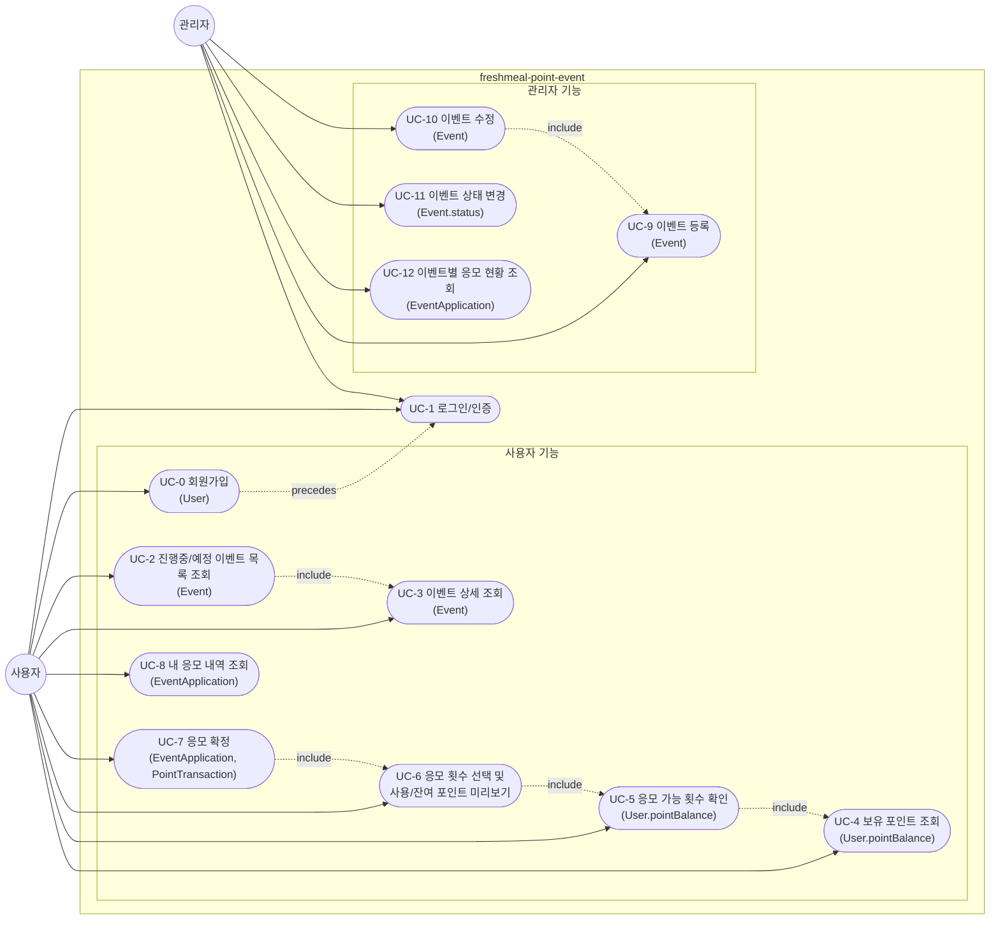

# freshmeal-point-event Use Case Diagram

`docs/2-domain-definition.md`의 2장(핵심 액터), 3장(핵심 도메인 엔티티), 4장(유스케이스 목록)을 기반으로 작성한 유스케이스 다이어그램이다.

- 액터: 사용자(User), 관리자(Admin) — 2장
- 유스케이스: UC-0~UC-12 — 4장 (괄호 안은 관련 핵심 엔티티, 3장)
- 두 액터 모두 인증(로그인) 후에만 시스템을 이용할 수 있다(2장).

## 참고

- UC-7(응모 확정)은 3장 EventApplication/PointTransaction 엔티티 갱신과 직결되며, 도메인 정의서 5.1/5.2/5.3/5.7/5.8/5.9 규칙의 적용을 받는다.
- UC-9/UC-10(이벤트 등록/수정)은 동일한 Event 필수/선택 필드 유효성 규칙(3.2)을 공유한다.
