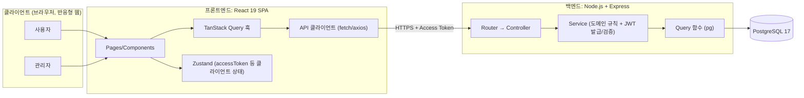
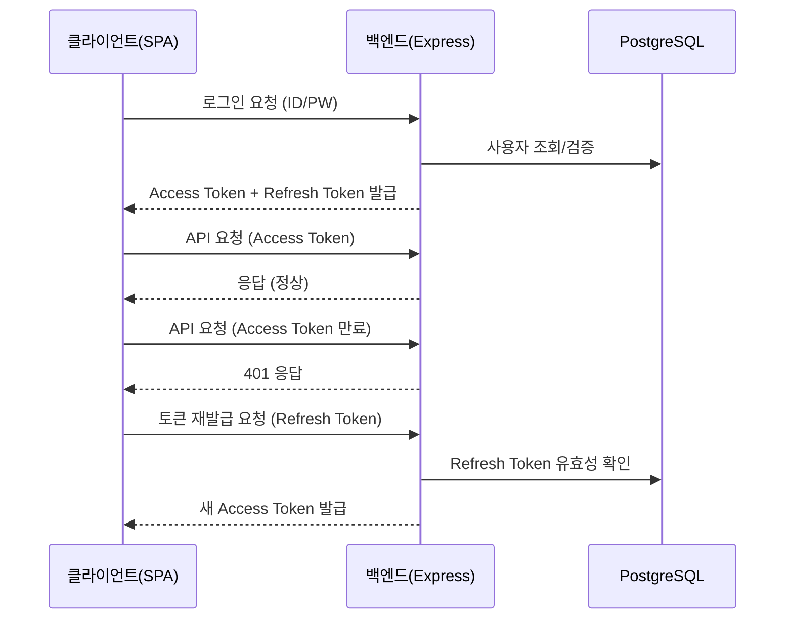

# 프레시밀 포인트 이벤트 응모(freshmeal-point-event) 기술 아키텍처 다이어그램

버전: v1.4 (2026-08-20)
기반 문서: `docs/4-PRD.md` v1.4, `docs/6-project-principle.md` v1.4

## 1. 전체 시스템 구성도

사용자/관리자가 브라우저로 React SPA에 접속하고, SPA가 Express API 서버를 거쳐 PostgreSQL에 접근하는 3일/1인 MVP의 실제 구성요소만 표현한 전체 구조다.

## 2. 프론트엔드 컴포넌트 구조

`6-project-principle.md` 6장 디렉토리 구조를 바탕으로, 화면(Pages)이 재사용 컴포넌트·상태·API 훅을 어떻게 조합하는지 표현한다.

```mermaid
flowchart TB
    subgraph Pages["Pages (화면)"]
        Signup["SignupPage"]
        Login["LoginPage"]
        EventList["EventListPage"]
        EventDetail["EventDetailPage"]
        MyApps["MyApplicationsPage"]
        AdminEvent["AdminEventListPage / AdminEventFormPage"]
        AdminStats["AdminEventStatsPage"]
    end

    subgraph Components["Components (공용 UI)"]
        AppHeader["AppHeader (상단 브랜드 바, 전 화면 공통)"]
        TopNav["TopNav (뒤로가기/로그아웃, 화면별)"]
        PointBadge["PointBalanceBadge"]
        EventCard["EventCard"]
        StatusBadge["EventStatusBadge"]
    end

    subgraph Features["Features (도메인별 API 훅)"]
        AuthHooks["auth: useLogin"]
        EventHooks["events: useEventList / useEventDetail / useApplyEvent"]
        AppHooks["applications: useMyApplications"]
    end

    Store["Zustand authStore (accessToken 등)"]
    Utils["utils/pointCalc (응모 미리보기 계산)"]

    Signup --> AuthHooks
    Login --> AuthHooks
    Login --> Store

    EventList --> AppHeader
    EventList --> TopNav
    EventList --> EventHooks
    EventList --> EventCard
    EventList --> PointBadge

    EventDetail --> AppHeader
    EventDetail --> TopNav
    EventDetail --> EventHooks
    EventDetail --> PointBadge
    EventDetail --> StatusBadge
    EventDetail --> Utils

    MyApps --> AppHeader
    MyApps --> TopNav
    MyApps --> AppHooks

    AdminEvent --> AppHeader
    AdminEvent --> TopNav
    AdminEvent --> EventHooks
    AdminStats --> AppHeader
    AdminStats --> TopNav
    AdminStats --> EventHooks

    TopNav --> Store
    AuthHooks --> Store
```

## 3. JWT 인증 요청 흐름

로그인 시 Access/Refresh Token을 발급받고, 이후 API 요청에는 Access Token을 사용하며 만료 시 Refresh Token으로 재발급받는 흐름을 간단히 표현한다.

## 4. 변경 이력

| 버전 | 일자 | 변경 내용 |
|---|---|---|
| v1.0 | 2026-08-13 | 초안 작성 (전체 시스템 구성도, JWT 인증 요청 흐름) |
| v1.1 | 2026-08-13 | 프론트엔드 컴포넌트 구조 다이어그램(2장) 추가, 이후 절 번호 조정 |
| v1.2 | 2026-08-13 | docs 전체 정합성 재검토 반영: 기반 문서 라벨을 PRD v1.4, 구조 설계 원칙 v1.2로 정정 |
| v1.3 | 2026-08-20 | BE-1~BE-9 실제 구현 반영 정합성 재검토: 전체 시스템 구성도(1장)는 Router→Controller→Service→Query 흐름을 추상적으로 표현해 실제 구현(admin-events.router.js 분리, applications 컨트롤러의 상위 도메인 router 마운트 등 세부 라우팅 방식)과 여전히 일치함을 확인, 기반 문서 라벨만 구조 설계 원칙 v1.3으로 정정 |
| v1.4 | 2026-08-20 | FE-1~FE-9 완료 이후 추가된 공통 컴포넌트 반영: 2장 프론트엔드 컴포넌트 구조도에 `AppHeader`(상단 브랜드 바)·`TopNav`(뒤로가기/로그아웃)를 Components에 추가하고 전 Pages와의 연결관계 표기, 기반 문서 라벨을 구조 설계 원칙 v1.4로 정정 |
