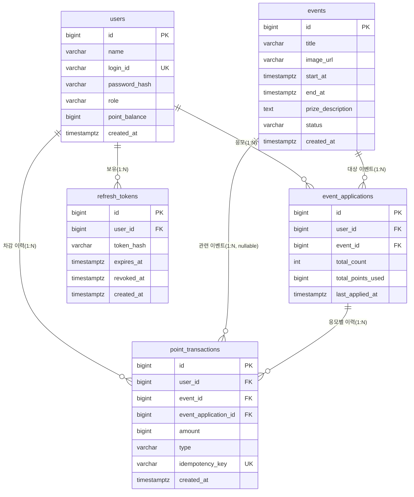

# 프레시밀 포인트 이벤트 응모(freshmeal-point-event) ERD

버전: v1.3 (2026-08-20)
기반 문서: `docs/2-domain-definition.md` v1.5, `docs/4-PRD.md` v1.4, `docs/6-project-principle.md` v1.4

## 1. 다이어그램

## 2. 테이블 설명

### 2.1 users
- name(표시 이름), login_id(유일), role(user/admin), point_balance(보유 포인트).
- `point_balance >= 0` 불변식을 CHECK 제약으로 강제한다 (도메인 5.2).
- 도메인 3.1 대응.

### 2.2 events
- title/start_at/end_at/status 필수, image_url/prize_description은 nullable.
- `end_at > start_at` CHECK 제약을 둔다 (도메인 3.2).
- status는 `예정`/`진행중`/`종료` 중 하나이며, 전이는 애플리케이션 로직에서 순방향(예정→진행중→종료)만 허용한다 (도메인 3.2).
- 도메인 3.2 대응.

### 2.3 event_applications
- user_id, event_id는 각각 users/events FK.
- `(user_id, event_id)` UNIQUE 제약으로 User-Event 조합당 1건만 존재하도록 강제하고, 재응모 시 total_count/total_points_used를 누적 갱신한다 (도메인 3.3, 5.4).

### 2.4 point_transactions
- user_id FK(필수), event_id/event_application_id는 nullable FK이나 MVP 범위(type=EVENT_APPLY 고정)에서는 항상 값이 채워진다 (도메인 3.4).
- idempotency_key UNIQUE 제약으로 동일 요청 재시도 시 중복 차감을 방지한다 (도메인 5.8).
- amount는 항상 양수로 기록하며 증감 방향은 type으로 판단한다 (도메인 3.4).

### 2.5 refresh_tokens
- PRD 7장 JWT Access+Refresh Token 인증과 PRD 10장 리스크(로그아웃 시 즉시 무효화를 위한 저장소 필요)에 대응하는 테이블이다.
- token_hash로 원문 대신 해시를 저장하고, revoked_at으로 로그아웃/폐기 여부를 관리한다.
- 도메인 정의서에는 없는 인증 인프라용 테이블이며, 도메인 핵심 엔티티(3장)에는 포함되지 않는다.

## 3. 범위 밖 사항

- Wallet 등 포인트 외 별도 자원 엔티티는 두지 않는다 (도메인 6장 제외 범위).
- point_balance는 파생값이 아닌 users의 실제 컬럼이며, 별도 잔액 이력 테이블을 두지 않는다 (도메인 3.1, 5.7 — point_transactions로 이력만 별도 추적).

## 4. 변경 이력

| 버전 | 일자 | 변경 내용 |
|---|---|---|
| v1.0 | 2026-08-13 | 초안 작성 (users/events/event_applications/point_transactions/refresh_tokens ERD 및 도메인 규칙 매핑) |
| v1.1 | 2026-08-13 | docs 전체 정합성 재검토 반영: 기반 문서 라벨을 PRD v1.4, 구조 설계 원칙 v1.2로 정정 |
| v1.2 | 2026-08-20 | BE-1~BE-9 실제 구현 반영 정합성 재검토: 실제 DB 스키마는 이번 백엔드 개발 기간 동안 변경되지 않아 ERD 내용은 그대로이며, 기반 문서 라벨만 구조 설계 원칙 v1.3으로 정정 |
| v1.3 | 2026-08-20 | FE-1~FE-9 완료 이후 정합성 재검토: 프론트엔드 UI 변경은 DB 스키마에 영향이 없어 ERD 내용은 그대로이며, 기반 문서 라벨만 구조 설계 원칙 v1.4로 정정 |
